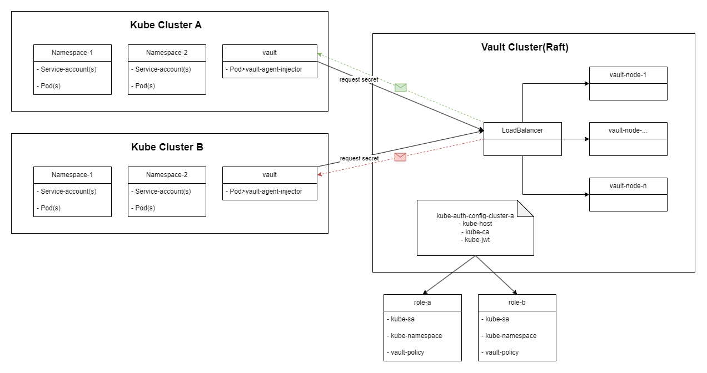

# Run on Kubernetes

## Vault Agent Injector <a href="#vault-agent-injector-vs-vault-csi-provider" id="vault-agent-injector-vs-vault-csi-provider"></a>

### 🔧 What is Vault Agent Injector?

The **Vault Agent Injector** is a Kubernetes **mutating admission webhook** that automatically **injects Vault secrets** into your pods, without requiring app-level changes.

***

### 🚀 Key Features

* **Inject secrets into pods as environment variables or files**
* **Automatically authenticate** with Vault using Kubernetes ServiceAccount
* **Runs a Vault Agent sidecar** to renew tokens and secrets
* Supports **templating**, so you can format secrets as needed
* Helps **avoid putting Vault logic into your application code**

***

### 🧱 How It Works (High-level Flow)

1. ✅ You **enable Kubernetes auth** and configure roles in Vault
2. ✅ You **deploy Vault Agent Injector** to your Kubernetes cluster
3. ✅ You **annotate your pod** to request secrets from Vault
4. 🧠 When the pod starts:
   * The webhook **adds a Vault Agent sidecar container**
   * Vault Agent authenticates using **Kubernetes ServiceAccount**
   * Vault Agent fetches and injects secrets to **volume files** or **env vars**
5. 🔄 Vault Agent **automatically renews** secrets and tokens

<figure><figcaption></figcaption></figure>

***

### 🧩 Pod Annotations Example

```yaml
annotations:
  vault.hashicorp.com/agent-inject: "true"
  vault.hashicorp.com/role: "my-app-role"
  vault.hashicorp.com/agent-inject-secret-config: "secret/data/my-app/config"
```

***

### 🛡️ Security Notes

* Each app should have a **unique Vault role and policy**
* Secrets are stored in **memory (env)** or in **volume (files)** inside the pod
* Uses **short-lived tokens**, and the agent **renews them automatically**

***

### 📦 Resource Footprint

* Adds **1 sidecar container per app pod**
* Each **namespace** can use the injector; **1 injector per cluster** is typical
* Requires **mutating webhook permissions**

### **❓How to**

#### 🔐 1. Vault Setup (Once)

*   **Enable Kubernetes auth method** in Vault:

    ```bash
    vault auth enable kubernetes
    ```
*   **Configure Kubernetes auth**:\
    Vault needs your cluster’s `service account JWT`, `CA cert`, and `API server address`.

    ```bash
    vault write auth/kubernetes/config \
      token_reviewer_jwt="<JWT>" \
      kubernetes_host="https://<API_SERVER>" \
      kubernetes_ca_cert=@/path/to/ca.pem
    ```
*   **Create Vault role** that maps a Kubernetes service account to a Vault policy:

    ```bash
    vault write auth/kubernetes/role/my-app \
      bound_service_account_names="my-app-sa" \
      bound_service_account_namespaces="my-namespace" \
      policies="my-app-policy" \
      ttl="24h"
    ```

***

#### 🧩 2. App Deployment with Annotations

* You deploy a pod that includes Vault annotations:

```yaml
annotations:
  vault.hashicorp.com/agent-inject: "true"
  vault.hashicorp.com/role: "my-app"
  vault.hashicorp.com/agent-inject-secret-config: "secret/data/my-app/config"
```

[More annotation](https://developer.hashicorp.com/vault/docs/deploy/kubernetes/injector/annotations)

***

#### 🧠 3. Injector Admission Webhook Intercepts Pod

* Kubernetes **sends pod creation request** to Vault Agent Injector (mutating webhook).
* Injector **modifies the pod spec**:
  * Adds a `vault-agent` **sidecar container**
  * Mounts a **shared memory volume**
  * Adds **init container** to write templates (optional)

***

#### 🗝️ 4. Vault Agent Sidecar Authenticates to Vault

* Vault Agent uses Kubernetes auth method:
  * Reads the pod’s **service account JWT**
  * Sends it to Vault at `auth/kubernetes/login`
  * Gets back a **Vault token**

***

#### 📥 5. Vault Agent Fetches Secrets

*   Vault Agent reads the path:

    ```bash
    secret/data/my-app/config
    ```
* Based on template config (default or custom), writes secrets to:
  * `/vault/secrets/<filename>` (as a file)
  * Or sets as environment variable

***

#### 🔄 6. Vault Agent Renews Token and Secrets

* Agent automatically handles:
  * **Renewing the Vault token**
  * **Renewing leased secrets** (e.g., database credentials)

***

#### 🔚 7. App Reads the Secret

*   App reads file from:

    ```
    /vault/secrets/config
    ```
* Or uses env variable injected by the Vault Agent
